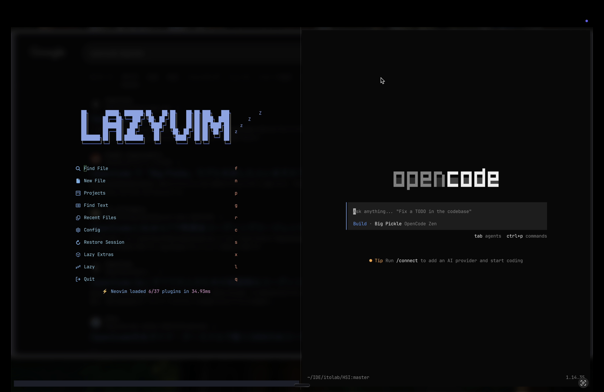

# Human Science Interaction (HSI)

Human Science Interaction（HSI）は、**科学研究における AI コーディングエージェントの活用**を探求・実践するプロジェクトです。

研究者が AI を研究の強力なパートナーとして活用するための知見、設定、ベストプラクティスを体系化し、共有します。

さらにこのリポジトリでは、ローカルモデルとMCPを用いて、膨大な論文から必要な情報（知識）を抽出する一般的な科学タスクやプロテインコロナの解析（プロテオミクス）などを本実装し、また共有します。

## このリポジトリの目的

- 科学研究のコード作成・データ解析・論文執筆を AI コーディングエージェントで効率化する
- プログラミングに不慣れな研究者でも AI を活用できるセットアップを提供する
- 実験的な試みや得られた知見をコミュニティと共有する

## 使用ツール

### [OpenCode](https://opencode.ai)

OpenCode は、ターミナル・デスクトップ・IDE で動作する**オープンソースの AI コーディングエージェント**です。
GitHub では 150K 以上のスターを獲得し、多くの開発者に利用されています。

- 何よりも**100% Opensource**
- **75+ の LLM プロバイダ**に対応（Claude, GPT, Gemini, ローカルモデルなど）
- **Plan / Build モード**の切り替えで、計画と実装を分けて作業可能
- **MCP（Model Context Protocol）** に対応し、外部ツールと連携
- **無料モデル**が組み込まれており、API キーなしでもすぐに使い始められる

## ドキュメント一覧

### 📖 コンセプト

| ドキュメント | 説明 |
|---|---|
| [OpenCode とは？](docs/concept/WHAT_IS_OPENCODE.md) | 科学者向けに OpenCode の概念や仕組みをわかりやすく解説 |

### 🔧 インストールガイド

「EditorやTerminalをいじりたくない」または「面倒な環境構築をしたくない」という方はdesktopアプリをinstallすることを推奨します。

| ドキュメント | 説明 |
|---|---|
| [OpenCode CLI のインストール](docs/cli/INSTALL.md) | macOS / Windows への nix を使ったインストール手順 |
| [OpenCode Desktop のインストール](docs/desktop/INSTALL.md) | GUI アプリケーション版のインストール手順 |

### 📚 チュートリアル

| ドキュメント | 説明 |
|---|---|
| [最初の一歩チュートリアル](docs/tutorial/FIRST_STEPS.md) | 実際の研究タスクを通じて OpenCode の使い方を学ぶ |
| [研究ワークフロー活用例](docs/usecases/RESEARCH_WORKFLOW.md) | データ解析・シミュレーション・論文執筆など場面別の活用法 |

### 💡 使い方のコツ

| ドキュメント | 説明 |
|---|---|
| [効果的なプロンプトの書き方](docs/tips/EFFECTIVE_PROMPTING.md) | OpenCode に指示を出すコツとテンプレート集 |
| [ターミナルの基礎知識](docs/basics/TERMINAL_BASICS.md) | ターミナル操作に不安がある方向けの入門ガイド |

### ❓ サポート

| ドキュメント | 説明 |
|---|---|
| [よくある質問（FAQ）](docs/faq/FAQ.md) | セットアップや使用中によくある質問と回答 |

---

### 設定ガイド

| ドキュメント | 説明 |
|---|---|
| [ローカルモデルの利用方法](docs/cli/LOCAL_MODEL.md) | Ollama / LM Studio を使ったローカル LLM の設定と OpenCode との連携 |
| [MCP の利用方法](docs/cli/MCP.md) | Model Context Protocol を使った外部ツール連携の設定方法 |

## 必要な環境

- macOS 12+ / Linux / Windows（WSL2 または Desktop 版）
- ターミナル（WezTerm を推奨）
- Git
- nix（パッケージマネージャ、推奨）
- （オプション）各種 LLM プロバイダの API キー

## ライセンス

このリポジトリのドキュメントは MITで提供されます。
著作権の明示さえあれば、この資料を営利・不営利問わず活用改変して構いません。
もちろん授業等で使ってもかまいません。
ISSUE,PullRequestを歓迎しています。
悪意のある活用・配布、MITの規約違反などは法的措置を講じる可能性があります。
詳しくは[LICENSE](./LICENSE)まで。
