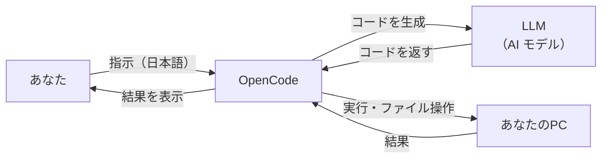

# OpenCode とは？

このページでは、「AI コーディングエージェント」という言葉に馴染みのない研究者の皆さんに向けて、OpenCode がどんなツールなのかを丁寧に説明します。

---

## AI コーディングエージェントって何？

**AI コーディングエージェント** とは、あなたの代わりにプログラムを書いたり、データを解析したりしてくれる** AI アシスタント**です。

イメージとしては：

> 💡 **「コードが書ける ChatGPT」** だと思ってください。

ChatGPT に「このデータを解析して」と頼むと**文章での説明**は返ってきますが、実際に動くコードはくれません。OpenCode なら、**実際に動くプログラム**を生成し、あなたのパソコン上で**実行**までしてくれます。

---

## OpenCode でできること

研究において、以下のようなことが可能になります：

| できること | 具体例 |
|---|---|
| **データ解析** | CSV ファイルを読み込み、統計処理し、グラフを描く |
| **コードの作成** | 「実験結果を可視化する Python スクリプトを書いて」 |
| **コードの説明** | 他人が書いたプログラムの動作を解説してもらう |
| **バグ修正** | エラーが出るコードを直してもらう |
| **論文執筆支援** | LaTeX のテンプレート作成、参考文献の整形 |
| **シミュレーション** | 数値計算やシミュレーションコードの作成 |

---

## ChatGPT や Claude と何が違うの？

最も重要な違いは**ファイルを直接操作できる**ことです。

```
ChatGPT / Claude（Web 版）
  あなた: 「この CSV を解析して」
  → AI:「こういうコードを書けばできますよ」（文章での説明）
  → あなた: 自分でコードをコピペして実行（手間）

OpenCode
  あなた: 「この CSV を解析して」
  → AI: 自動でコードを書き、実行し、結果を表示
  → あなた: 結果を見て「もっとこうして」と追加指示
```

OpenCode はあなたの**プロジェクトフォルダの中に入り**、ファイルの読み書き・プログラムの実行・Git 操作などをエージェント自ら行います。

---

## なぜ研究者に便利なのか？

研究では日々、以下のような「ちょっとしたプログラミング」が必要になります：

- 実験データのプロット
- 統計検定
- ファイル形式の変換
- シミュレーションの実行
- 論文用の図の作成

これらのたびに一からコードを書くのは時間がかかります。OpenCode なら**自然言語で指示するだけで**目的のコードを生成・実行できます。

---

## どんな仕組みなの？（簡単に）



1. あなたが「このデータを解析して」と**日本語で指示**
2. OpenCode が**AI モデル（Claude, GPT など）**にコード生成を依頼
3. 生成されたコードを**あなたの PC で実行**
4. 結果を**あなたに報告**
5. さらに追加の指示を出すと、それを踏まえて改善

---

## 用語集

このドキュメントで出てくる用語を簡単に説明します：

| 用語 | わかりやすい説明 |
|---|---|
| **LLM** | Large Language Model（大規模言語モデル）。ChatGPT や Claude の脳みそにあたる AI |
| **CLI** | Command Line Interface。キーボードで文字を打って操作する方法 |
| **GUI** | Graphical User Interface。マウスでクリックして操作する方法 |
| **ターミナル** | CLI を操作するための黒い画面。Mac の「ターミナル.app」など |
| **パッケージマネージャ** | ソフトウェアを簡単にインストール・管理するためのツール |
| **API キー** | AI モデルを使うための「合言葉」。秘密にしてください |
| **MCP** | Model Context Protocol。OpenCode が外部ツールと連携する仕組み |

---

## 次のステップ

- [インストールガイド（CLI）](../cli/INSTALL.md) — ターミナルで使う場合
- [インストールガイド（Desktop）](../desktop/INSTALL.md) — GUI アプリで使う場合
- [ターミナルの基礎知識](../basics/TERMINAL_BASICS.md) — ターミナル操作に不安がある方へ
- [最初の一歩チュートリアル](../tutorial/FIRST_STEPS.md) — 実際に研究で使ってみる
